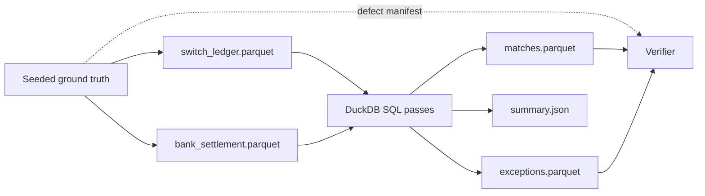

# Payments reconciliation engine


**Live write-up & in-browser demo (runs this repo's actual SQL via DuckDB-WASM):** [portfolio-site-eosin-eta.vercel.app/projects/payments-reconciliation-engine](https://portfolio-site-eosin-eta.vercel.app/projects/payments-reconciliation-engine)


This is a deterministic, SQL-first reconciler for a real-time switch ledger and a bank settlement file. The matching rules live in numbered `sql/` passes, so the same logic can run locally in DuckDB and in a DuckDB-WASM browser demo.

## Quickstart

```sh
python3 -m pip install -r requirements.txt
python3 -m recon generate --seed 42 --count 100000
python3 -m recon run
python3 -m recon verify
```

Or run the full million-row walkthrough:

```sh
make demo
```

Inputs are deliberately separate from the verification oracle:

- `data/input/`: switch and bank ledger views; the reconciler reads only these.
- `data/oracle/defect_manifest.parquet`: generator ground truth, read only by `recon verify`.
- `data/output/`: `matches.parquet`, `exceptions.parquet`, `summary.json`, and `verification.json`.

## Correctness contract

The generator injects disjoint, seeded defects and writes the corresponding manifest. `recon verify` compares detected `(txn_id, defect_class)` pairs in the reconciliation outputs with that manifest. It reports recall and precision for every class and exits nonzero unless every injected defect is rediscovered (100% recall) with no detections absent from the manifest (zero false positives).

Matching is ordered and auditable: exact UTR plus amount/status/date, then constrained fuzzy rescue by amount, ±1 settlement day, and counterparty prefix, then residual classification. Every fuzzy rescue includes a `match_reason`.

## Failure modes

| Failure mode | Engine behavior |
|---|---|
| Missing bank settlement | `MISSING_IN_BANK`, critical severity |
| Missing switch attempt | `MISSING_IN_SWITCH`, critical severity |
| Repeated UTR on either or both sides | `DUPLICATE`; key excluded from later matching |
| Same UTR but amount or status differs | `AMOUNT_MISMATCH` or `STATUS_MISMATCH` exception |
| Settlement appears one day late | `LATE_SETTLEMENT` exception |
| Mangled reference with unique constrained candidate | Fuzzy match with `REFERENCE_MANGLED` detection and audit reason |
| More than one constrained fuzzy candidate | `AMBIGUOUS`; no automatic match |
| Empty bank input | All switch rows classify missing and summary contains `BANK_INPUT_EMPTY` |

## Cost & measured scale

| Volume | Wall-clock | Result |
|---|---|---|
| 1M transaction pairs | **4.7s** | 100% recall on 35,000 injected defects, 0 false positives |
| 5M transaction pairs | 217s | 100% recall on 175,000 injected defects, 0 false positives |

Single laptop (M-series, DuckDB), $0 infrastructure. The 5M run is memory-bound on a machine also hosting a streaming pipeline VM — DuckDB spills to disk; on a dedicated 32GB node it stays in the seconds range. The SQL is engine-portable (Spark/Trino) if volumes outgrow one node.

**