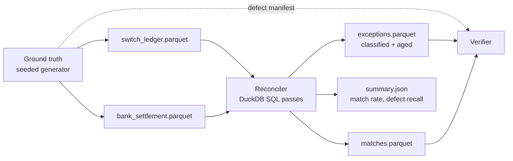

# Architecture

Reconciliation between two views of the same payment traffic that deliberately disagree: a **switch ledger** (real-time, authoritative for attempts) and a **bank settlement file** (T+1 batch, authoritative for money movement). A seeded generator produces ground truth plus both views with injected defects; the engine reconciles them and must rediscover every injected defect — the test oracle is built into the data.

## The two systems disagree on purpose

| Defect (injected at configurable rates) | Real-world cause |
|---|---|
| `MISSING_IN_BANK` | Auth succeeded, settlement never happened (drop) |
| `MISSING_IN_SWITCH` | Force-posted settlement, no auth record |
| `DUPLICATE` | Retries double-posted on one side |
| `AMOUNT_MISMATCH` | Fees/rounding/currency-minor-unit bugs |
| `STATUS_MISMATCH` | Switch says FAILED, bank settled it anyway |
| `LATE_SETTLEMENT` | Lands in the next day's file (T+2) |
| `REFERENCE_MANGLED` | Truncated/case-shifted UTR breaks exact keys |

## Matching: deterministic multi-pass (ADR-0001)

1. **Pass 1 — exact:** join on `utr` (unique transaction reference), then verify amount/status equality; mismatches become classified exceptions, not silent matches.
2. **Pass 2 — fuzzy rescue:** for residuals, match on (amount, ±1 day, counterparty prefix) with tie-breaking rules; catches mangled references. Every fuzzy match records *why* it matched (audit trail).
3. **Pass 3 — classification:** residuals become `MISSING_IN_*`; repeated keys become `DUPLICATE`; everything gets severity + aging buckets.

All passes are **DuckDB SQL** (ADR-0002); Python only orchestrates. The same SQL runs in the browser via DuckDB-WASM on the portfolio site.

## Correctness contract

`recon verify` joins the engine's output against the generator's defect manifest and reports **recall and precision per defect class**. The engine's headline claim is not "it runs" but "it rediscovers 100% of injected defects at defect rates ≤ configured thresholds, with zero false positives on clean pairs."

## Failure modes

| Failure | Behavior |
|---|---|
| Same UTR, both sides duplicated | Pairwise dedup before matching; both flagged, neither double-matched |
| Fuzzy pass matches two candidates | Deterministic tie-break (closest date, then lowest id); ambiguity logged as `AMBIGUOUS` exception, never guessed silently |
| Whole settlement file missing | Every switch row exceptions as `MISSING_IN_BANK` with file-level alarm in summary |
| Defect rates so high fuzzy pass misfires | Verifier catches recall/precision drop — thresholds documented from measurement |

## Cost / scale

Single machine, DuckDB: 10M transaction pairs reconcile in seconds-to-minutes, $0 infra. The write-up includes measured wall-clock at 1M/10M rows. Scaling story: the SQL is engine-portable (Spark/Trino) if volumes outgrow one node.
